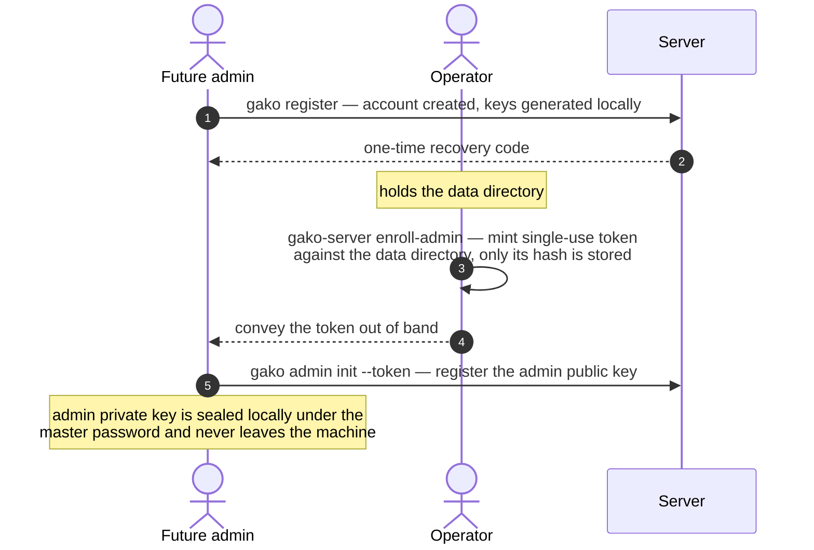

# Administration

This section is for operators running a Gako instance for themselves or a team.
It picks up where [Installation](../install/index.md) leaves off — a server
that is running but has no administrator yet — and takes you to a bootstrapped,
usable instance: a first administrator, a stored secret, and a machine identity
for automation.

!!! warning "Pre-release"
    Gako is a development build and has **not been audited**. These workflows
    are exercised end-to-end, but treat the instance as experimental and do not
    store real secrets in it yet.

## The admin trust model

Administration sits on the same trust boundary as everything else. An
administrator manages identities, credentials, and policy — but, exactly like
the server, **an administrator cannot read secret content**. There is no admin
override, because admins hold no decryption keys; secrets are encrypted to their
recipients' keys, which never reach an administrator any more than they reach
the server. What admin authority governs is the *frame* around secrets —
who holds an identity, which machine may read which secret — not the secrets
themselves. See the [zero-knowledge model](../concepts/zero-knowledge.md) for
the guarantee this rests on.

That authority is enforced by the protocol, not the UI. Admin-tier operations
require a signature from an **admin credential**, a signing key held only by
installed clients (the CLI today). The server refuses admin operations from a
web session no matter who is logged in or what the page claims — so the web
client genuinely cannot administer, and the CLI is the admin vehicle.

## What you need

- A running server (see [Installation](../install/index.md)).
- The `gako` CLI built from the same tree (`cd clients/cli && go build -o gako .`).
- Shell access to the server's **data directory** — the operator's root of
  trust for bootstrapping.

The examples below talk to a local instance and set the server URL once via the
CLI's `--server` flag; after the first command the CLI remembers it. Adjust the
URL to your instance (e.g. `https://gako.example.com`).

## Bootstrapping the first administrator

A fresh instance has no administrators and, deliberately, no built-in one to
fall back on. So where does the *first* admin's authority come from? Not from the
server — the server holds no keys and certifies no one. It comes from **you, the
operator**, because you already hold the one thing more privileged than any API
credential: filesystem access to the **data directory**. Bootstrapping is the act
of carrying that filesystem-level trust across into an API-level admin credential,
exactly once, for one account.

That hand-off is a single-use **elevation token**. It exists so the two halves of
the ceremony can happen on different machines and at different times: the future
admin registers and enrolls from their own client (where their keys live), while
you mint the token on the server host (where the data directory lives). The token
is the bridge between them — minting it requires the data directory; redeeming it
enrolls the admin key.

The ceremony has three moves, across three roles:



If you are both the operator and the first admin — the common single-person
case — you play all three roles yourself: register, mint, redeem. The steps below
walk through each move.

### 1. Register the account

The administrator-to-be first needs an ordinary account. Anyone can self-register
against the server; nothing about registration is privileged. Registration
generates the account's keys locally and shows a **recovery code exactly once** —
it is the only way back into the account if the master password is lost.

```sh
gako register --server http://127.0.0.1:8347 --email admin@example.com
```

```
Master password: ········
Master password (again): ········

Account created. This is your RECOVERY CODE — it is shown exactly once.
...
    d2ffd483-40580ace-e9731cd1-27912918-1bd31b76-22b34f75-52f951af-e0cceeff

export GAKO_SESSION=<session-key>
```

`eval "$(gako login)"` (or evaluating the printed `export` line) unlocks the
shell so later commands don't re-prompt. See the
[CLI client](../clients/cli.md) for the session model.

!!! note "The web client can register too"
    A user can equally create their account in the browser. The admin
    *credential* below, however, must be enrolled from the CLI — the web tier
    never holds an admin key.

### 2. Mint an elevation token (operator)

On the server host, with access to the data directory, mint a single-use token
that authorizes **one** admin enrollment for that account:

```sh
gako-server enroll-admin --data-dir ./gako-data --email admin@example.com
```

```
Elevation token for admin@example.com (single use, valid 1h0m0s — shown once, only its
hash is stored). Convey it to the user out of band; they redeem it with:

    gako admin init --token <token>

duZ8hWf7q8FH...<token>...
```

The token (32 random bytes) prints once on stdout; the server stores only its
SHA-256 hash, with the target account and an expiry (`--ttl`, default `1h`).
Convey it to the user out of band. This command opens the same database a
running server uses, so you can run it while the server is up.

### 3. Redeem it (the new admin)

From the CLI — an installed client — the user runs the elevation ceremony. It
generates the admin keypair, proves possession, and registers the public key
under the token. The private key is sealed under the master password in
`admin.json` (mode `0600`) and never leaves the machine.

```sh
gako admin init --token duZ8hWf7q8FH...
```

```
Admin credential enrolled and sealed under your master password.
Admin commands will ask for the password again — that is by design.
3b00b72a-f479-4944-9e43-eedbde996b63
```

That last line is the new credential's ID. `gako` prints machine-readable
identifiers to stdout and the human-readable confirmation to stderr, so the bare
UUID is what a script would capture; it is the same ID that `admin list` reports
next.

### 4. Confirm

```sh
gako admin status        # local: is a credential enrolled on this machine?
gako admin list          # server-side: this account's credentials and status
```

```
3b00b72a-f479-4944-9e43-eedbde996b63  active  (this machine)
```

The account is now an administrator. Admin commands re-prompt for the master
password every time (sudo-style): one password entry opens a throwaway session
*and* unseals the admin key. Admin operations are rare and the friction is
deliberate.

!!! note "Each device enrolls its own credential"
    An admin credential is per-device — it cannot be copied to another machine,
    because it is sealed under that machine's stored state. To administer from a
    second machine, mint another elevation token and run `gako admin init`
    there. To step an admin down, revoke the credential:

    ```sh
    gako admin revoke            # revokes this machine's credential (admin-signed)
    gako admin revoke <cred-id>  # revoke a specific one
    ```

    Revocation is itself an admin operation, takes effect immediately
    server-side, and deletes the local `admin.json` when a credential revokes
    itself. Re-enrollment needs a fresh elevation token.

## Users and identities

Gako has three kinds of principal: **users** (people, with a master password and
recovery code), **machines** (non-interactive automation identities), and
**recovery** identities (org-scoped, Phase 4).

Because the system is zero-knowledge, identities are not *minted* by an
administrator — an admin holds no one's keys and cannot generate a keypair on
someone's behalf. Instead:

- **Users self-register** (`gako register`, or the web client), generating their
  own keys on their own device. To onboard a teammate, point them at the server
  URL and have them register; what an administrator then governs is policy and
  credentials, not the user's keys.
- **Machine identities are provisioned by an administrator** (next section) —
  these have no human and no master password, so the admin client generates
  their keys and hands over a credential file.
- **Admin credentials** are enrolled per the ceremony above and managed with
  `gako admin list` / `gako admin revoke`.

Identifying a user: every principal has a random UUID and (for users) an email,
both of which the server holds in the clear as login/addressing metadata. The
fingerprint shown by `gako status` is the user's public-key fingerprint, used
for out-of-band verification when sharing.

!!! note "Draft — human-account lifecycle"
    Suspending or deleting a *human* account is not yet exposed as a standalone
    operator command; today's instance-level identity management is admin
    credentials and machine identities, both covered here. Team membership lives
    a layer up — see [Organizations](#organizations) below.

## Machine identities for automation

A machine identity is a first-class principal for non-interactive consumers — CI
jobs, daemons, cron, backups. It has its own keypair, no master password, is
**read-only**, gets **short-lived sessions**, and is scoped to exactly the
secrets you grant it. Provisioning and revocation are admin-tier; granting a
specific secret is an ordinary owner operation. See the machine-auth model in
the [CLI client](../clients/cli.md) page.

### Provision

```sh
gako machine create backup-runner --out /etc/gako/backup-runner.json
```

```
Machine "backup-runner" provisioned. Credential file (0600, shown never again): /etc/gako/backup-runner.json
...
104258b4-2b1a-4528-abe4-fd6e5b019b46
```

This is admin-signed (it prompts for the master password). It generates the
machine's keys locally, registers the public halves with the server, and writes
the **credential file** holding the private keys — once, mode `0600`, refused if
the path already exists. Move it to the target machine over a secure channel and
delete intermediate copies.

### Scope

A freshly provisioned machine can read nothing. Grant it exactly the secrets it
needs, one at a time:

```sh
gako machine grant backup-runner "Prod DB"
gako machine list
```

```
NAME           PRINCIPAL                             STATUS  CREATED
backup-runner  104258b4-2b1a-4528-abe4-fd6e5b019b46  active  2026-06-15
```

Each grant is the machine's whole scope — it reads its granted secrets and
nothing else. Revoke a single grant with `gako machine ungrant backup-runner
"Prod DB"`.

### Consume

On the consuming host, point `GAKO_MACHINE_CREDENTIALS` at the credential file
and run any read command — typically `gako run`, which maps secret fields into a
child process's environment and nothing more:

```sh
GAKO_MACHINE_CREDENTIALS=/etc/gako/backup-runner.json \
  gako run --env PGPASSWORD="Prod DB" -- pg_dump mydb
```

The job sees exactly the mapped secrets; key material is wiped from the `gako`
process before the command starts.

### Revoke

```sh
gako machine revoke backup-runner
```

Revocation is admin-signed and immediate: every session dies, every **envelope**
— the per-recipient record that wraps a secret's key to one identity, so deleting
it removes that identity's access — is deleted, challenge login is refused, and
secrets the machine had read are flagged for rotation. One identity per machine keeps this surgical — it is the
complete, cheap remedy for a leaked credential file.

!!! warning "Secret zero"
    The credential file holds the machine's private keys behind file permissions
    alone. That is the residual exposure inherent to every non-interactive
    consumer ("secret zero"): documented, not hidden. Gako mitigates it with
    per-machine identities, grant scoping, server-enforced read-only,
    short-lived (≈15-minute) sessions, and audit prominence — but protect the
    file like an SSH private key, and revoke immediately if it leaks.

## Recovery basics

A user who forgets their master password recovers their account with two factors
the server checks independently: control of the account **email**, and the
offline **recovery code** shown once at registration. The operator's role is the
email factor — the reference server has no mail transport, so you mint and relay
the challenge after verifying the requester's identity out of band.

```sh
gako-server recovery-challenge --data-dir ./gako-data --email admin@example.com
```

```
Recovery challenge for admin@example.com (single use, valid 1h0m0s — shown once, only its
hash is stored). Verify the requester's identity, then convey it out of band;
they complete recovery with:

    gako recover --email admin@example.com
```

Like the elevation token, the challenge is single-use, stored only as a hash,
and time-limited (`--ttl`, default `1h`). The user completes recovery from a
client:

```sh
gako recover --email admin@example.com --challenge <token>
```

Recovery forces a master-password reset, **revokes every existing session**, and
issues a new recovery code (the old one stops working). The recovery code never
reaches the server, so the server alone — or an operator who only ever sees
hashes — cannot recover an account. Losing **both** the master password and the
recovery code is permanent loss of that vault, by design.

!!! note "Organization recovery is separate"
    The recovery above is for a *personal* account. Organizations add a second,
    independent path: an offline org recovery identity that can recover orphaned
    *org* secrets (it does not cover personal vaults), driven by
    `gako org recovery` / `gako org recover`. See
    [Organizations](#organizations) below.

## Backups and restore

The entire instance is the **data directory** (`gako.db` plus its `-wal`/`-shm`
companions). Back that up and you have backed up everything: principals, public
keys, ciphertext, envelopes, policy, sessions, and audit log.

This is where zero-knowledge pays off operationally. The data directory contains
**no plaintext secrets and no decryption keys** — only ciphertext and the
metadata a zero-knowledge server is allowed to hold. A backup is therefore as
safe as the system itself; an attacker who steals it learns no secret content.
Conversely, a backup is **not** enough to read anyone's secrets: restoring it
gives users back their ciphertext, but each still needs their own master password
(or recovery code) to decrypt. You are backing up the vault, never the keys to
it.

**Back up:**

```sh
# Simplest: stop the server, copy the directory.
cp -a /var/lib/gako/data /backups/gako-$(date +%F)
```

For a hot backup of a running instance, use SQLite's online backup against the
database file rather than copying the `-wal`/`-shm` files mid-write:

```sh
sqlite3 /var/lib/gako/data/gako.db ".backup '/backups/gako-$(date +%F).db'"
```

**Restore:** stop the server, put the database back as `gako.db` in a data
directory, and start the server pointed at it:

```sh
gako-server --data-dir /var/lib/gako/restored
```

!!! warning "Restoring an old snapshot can look like rollback"
    Clients detect server rollback: a returning client that is shown an *older*
    revision than it has already seen treats it as a security event and refuses
    the data (a deliberate protection against a malicious server replaying stale
    state). Restoring an older backup to a live instance can trip this for
    clients that were ahead of the snapshot. Restore is for disaster recovery of
    a lost instance, not for casually rewinding a live one; expect clients that
    had newer state to flag the mismatch until they reconcile.

## Organizations

Everything above gets a single operator to a working instance with users and
machine identities. **Organizations** are the next layer up: a shared trust root,
certified memberships, role-based authority, and shared collections of secrets
for a team. They are implemented today in the `gako` CLI — which is the
org-administration vehicle until a desktop client exists — and are the newest,
still-settling part of the product, so treat this as an orientation rather than a
complete reference.

### The org trust root

An organization is anchored by its own **root signing key**, generated locally
when the org is created and the org's identity from then on. This is what keeps
organizations zero-knowledge end to end, even from the server: members pin the
root **from the invite they receive**, never from the server, then verify every
membership certificate against that pinned root. A server that tried to swap an
org's root — to slip in a member it controls — is caught the instant a client's
pinned root disagrees with what the server serves (`gako org list` flags it
loudly as a `MISMATCH`).

Authority flows as a depth-two certificate chain: the **root** certifies admins,
and **admins** certify ordinary members after verifying their key fingerprint out
of band. The root's private half is written to an artifact file exactly once at
creation; move it to offline custody (print it, a safe, an HSM) and delete the
file. It is needed only to certify *new admins* — everyday onboarding uses an
admin's own identity key, so the root stays offline almost always.

### Roles

Roles gate **authority** — who may grant, write, and administer — not who can
read; revoking a role does not retract envelopes a member already holds (use
removal for that). A member is invited with a role and can be moved later with
`gako org role`.

| Role | Authority |
|---|---|
| `owner` | The founder. Full authority; cannot be assigned or removed (no ownership transfer yet). |
| `admin` | Full org administration: invite, certify, manage groups and collections, change roles, remove members. |
| `granter` | Files secrets into collections and fulfils access grants; cannot change membership or structure. |
| `member` | Reads the secrets shared to them through the org's collections. |
| `read_only` | Like a member, and cannot be granted write authority. |

### Lifecycle

The founder runs the trust-root ceremony, invites people, and certifies them as
they join. Invites and certifications are admin-tier (they prompt for the master
password, like every admin operation); the join happens on the invitee's client.

```sh
# Found the org — runs the trust-root ceremony and writes the offline
# root artifact once. You become its first certification authority.
gako org create acme

# Invite by account email; --role sets their authority (default: member).
# The printed code carries the org id and trust root — send it over a
# channel you trust, because the invite channel IS the verification channel.
gako org invite acme dev@example.com --role member

# The invited side accepts and PINS THE ROOT from the invite code, not the
# server. They confirm the displayed fingerprint with you out of band.
gako org join <invite-code>

# After verifying their key fingerprint out of band, certify them in.
# Certification IS the verification record — other members' clients accept
# their material only once this chain exists.
gako org certify acme dev@example.com

# Inspect membership, chain-verified against your pinned root.
gako org show acme
gako org list                # your memberships, each with its root-pin status
```

!!! note "Certifying another admin needs the root"
    Certifying an ordinary member uses your own identity key. Certifying someone
    as a *new admin* — a key that must itself carry certification authority —
    needs the offline root artifact: `gako org certify acme dev@example.com
    --root acme.gako-org-root.json`. That is the only routine reason to bring the
    root back out of custody.

### Beyond the core lifecycle

The CLI carries the rest of the org surface, all admin- or granter-tier:

| Area | Commands |
|---|---|
| **Collections** — named sets of secrets shared as a unit | `gako org collection create / list / add / remove / grant / ungrant` |
| **Groups** — named sets of members, grantable to collections | `gako org group create / list / add / remove / grant / ungrant` |
| **Membership** — role changes and removal | `gako org role`, `gako org remove` |
| **Hygiene** — exposure worklist and audit view | `gako org exposure`, `gako org audit` |
| **Org recovery** — recover orphaned *org* secrets (not personal vaults) | `gako org recovery init / rotate`, `gako org recover` |

Each of these deserves its own walkthrough; those will land here as the workflows
are exercised. Run any command with `--help` for its current flags in the
meantime.

## Beyond this guide

This page reaches a usable single-operator, small-team, or organization-backed
instance. The organization commands above are functional today but still
maturing, and full deployments will want the per-area walkthroughs noted there
once they are written.

## Related

- [Zero-knowledge model](../concepts/zero-knowledge.md) — why admins (and the
  server) cannot read secrets.
- [Installation](../install/index.md) — deploying and running the server.
- [CLI client](../clients/cli.md) — the admin and automation client in full.
